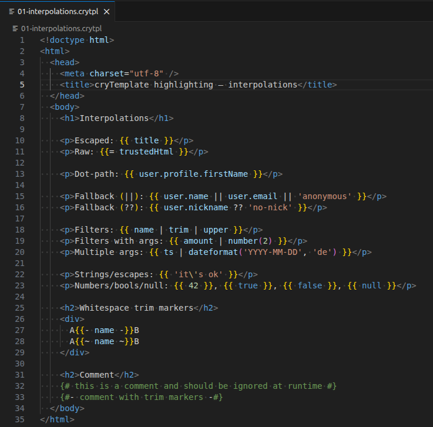

# cryTemplate Language Support

Provides syntax highlighting for `*.crytpl` / `*.crytemplate` templates used in this repository.

*cryTemplate* is a lightweight template engine with **zero runtime** dependencies. Interpolations are **HTML-escaped by default**, and templates cannot execute arbitrary JavaScript – just string magic with interpolation, control flow, iteration, filters, and HTML escaping. 🪄

For details about cryTemplate see <https://crymg.github.io/cryTemplate/>.

## Features

* Highlights cryTemplate interpolation tokens: `{{ ... }}` (escaped), `{{= ... }}` (raw)
* Highlights whitespace trim markers on open/close: `{{- ... -}}`, `{{~ ... ~}}`, ``, ``, `{#- ... -#}`
* Highlights cryTemplate control tokens: ``, ``, ``, ``, ``, ``
* Inline comments: `{# ... #}`
* Highlights `{{ ... }}` and `` tokens inside HTML and Markdown
* Also highlights HTML syntax in the same file.

## License

MIT License. See LICENSE file for details.

Copyright (c) 2026 cryeffect Media Group <https://crymg.de>, Peter Müller
